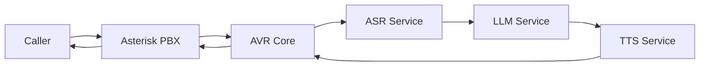
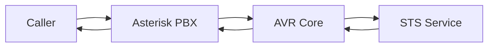

# Agent Voice Response (AVR)

<div align="center">

[](https://discord.gg/DFTU69Hg74)
[](https://ko-fi.com/agentvoiceresponse)
[](https://github.com/agentvoiceresponse)
[](https://hub.docker.com/r/agentvoiceresponse/avr-core)

**Transform Your IVR with AI-Powered Voice Conversations**

[Website](https://www.agentvoiceresponse.com/) • [Documentation](https://wiki.agentvoiceresponse.com) • [Community](https://discord.gg/DFTU69Hg74)

</div>

---

The **Agent Voice Response (AVR)** is a revolutionary open-source platform that transforms traditional Interactive Voice Response (IVR) systems into intelligent, conversational AI agents. Built on Asterisk's AudioSocket technology, AVR seamlessly integrates with your existing telephony infrastructure while providing unprecedented flexibility in AI service selection and deployment.

## Table of Contents
- [🚀 Quick Start](#-quick-start)
- [📋 Overview](#-overview)
- [🏗️ Architecture](#️-architecture)
- [✨ Key Features](#-key-features)
- [🔧 Installation](#-installation)
- [⚙️ Configuration](#️-configuration)
- [🎯 Use Cases](#-use-cases)
- [🔍 Troubleshooting](#-troubleshooting)
- [🤝 Community & Support](#-community--support)
- [📄 License](#-license)

## 🚀 Quick Start

Get AVR running in minutes with our pre-configured Docker Compose templates:

```bash
# Clone the infrastructure repository
git clone https://github.com/agentvoiceresponse/avr-infra.git
cd avr-infra

# Choose your AI provider combination and start
docker-compose -f docker-compose-openai.yml up -d

# Test with SIP client (username: 1000, password: 1000)
# Call extension 5001 to interact with your AI agent
```

**Need help choosing?** Check our [Configuration Guide](#️-configuration) below.

## 📋 Overview

AVR (Agent Voice Response) is a comprehensive platform that bridges the gap between traditional telephony systems and modern AI capabilities. At its core, AVR manages real-time voice communication between callers and AI-powered conversational agents through Asterisk's AudioSocket protocol.

### Core Components

AVR orchestrates five key AI services to create seamless voice conversations:

1. **🎤 ASR (Automatic Speech Recognition)**: Converts incoming audio streams into accurate text transcriptions
2. **🧠 LLM (Large Language Model)**: Processes text input and generates intelligent, context-aware responses  
3. **🔊 TTS (Text-to-Speech)**: Transforms AI-generated text into natural-sounding speech
4. **📝 STT (Speech-to-Text)**: Alternative transcription service for providers without native ASR support
5. **🗣️ STS (Speech-to-Speech)**: Direct voice-to-voice AI communication for ultra-low latency interactions

### Why AVR?

- **🔌 Universal Compatibility**: Works with any ASR, LLM, or TTS provider via standard HTTP APIs
- **🏢 Enterprise Ready**: Seamlessly integrates with existing Asterisk, FreePBX, VitalPBX, and Vicidial systems  
- **💰 Cost Effective**: Mix and match providers to optimize costs and performance
- **🚀 Rapid Deployment**: Docker-based architecture for quick setup and scaling
- **🛡️ Production Grade**: Built for reliability with comprehensive error handling and monitoring

## 🏗️ Architecture

AVR follows a modular, microservices architecture that enables flexible deployment and easy scaling.

### Traditional Flow (ASR + LLM + TTS)



**Step-by-step process:**
1. **📞 Call Initiation**: Customer dials extension, Asterisk answers and generates UUID
2. **🔗 AudioSocket Connection**: Asterisk establishes TCP connection with AVR Core
3. **🎤 Speech Recognition**: AVR Core streams audio to ASR service for real-time transcription
4. **🧠 AI Processing**: Transcribed text sent to LLM service for intelligent response generation
5. **🔊 Voice Synthesis**: AI response converted to speech via TTS service
6. **📢 Audio Playback**: Synthesized voice streamed back to caller through Asterisk

### Modern Flow (Speech-to-Speech)



**Ultra-low latency process:**
1. **📞 Direct Connection**: Customer connects via Asterisk AudioSocket
2. **🗣️ Real-time Processing**: Audio directly processed by STS service (OpenAI Realtime, Ultravox, etc.)
3. **⚡ Instant Response**: AI-generated speech immediately streamed back to caller

## ✨ Key Features

### 🔌 **Universal Provider Support**
- **50+ AI Providers**: Pre-built integrations with OpenAI, Anthropic, Google, Deepgram, ElevenLabs, and more
- **Cloud & Local Options**: Choose from cloud services or self-hosted solutions (Vosk, Ollama, CoquiTTS)
- **Mix & Match**: Combine different providers for optimal cost and performance
- **Custom Integration**: Easy HTTP API integration for any provider

### 🚀 **Performance & Reliability**
- **Real-time Streaming**: Sub-second latency with optimized audio processing
- **Voice Activity Detection**: Intelligent speech detection for natural conversations
- **Multi-codec Support**: Automatic detection of μ-law, A-law, and PCM audio formats
- **Error Recovery**: Robust error handling and automatic retry mechanisms
- **Horizontal Scaling**: Docker-based microservices for easy scaling

### 🎛️ **Advanced Capabilities**
- **Function Calling**: Support for OpenAI and Anthropic function calling
- **Ambient Noise**: Configurable background sounds for realistic environments
- **Webhook Integration**: Real-time event notifications for call analytics
- **Multi-language**: Support for 100+ languages and dialects
- **Custom Voices**: Personalized AI voice characteristics and personalities

### 🛡️ **Enterprise Features**
- **Asterisk Integration**: Native support for Asterisk 18+ with AudioSocket
- **PBX Compatibility**: Works with FreePBX, VitalPBX, Vicidial, and custom setups
- **Security**: End-to-end encryption and secure API communication
- **Monitoring**: Comprehensive logging and performance metrics
- **High Availability**: Built-in redundancy and failover capabilities

### 📊 **Analytics & Monitoring**
- **Call Metrics**: Detailed performance and usage statistics
- **Real-time Dashboards**: Live monitoring of system health and call quality
- **Webhook Events**: Custom event notifications for integration with external systems
- **Debugging Tools**: Comprehensive logging for troubleshooting

**🔗 Explore all available integrations**: [Agent Voice Response Integrations](https://github.com/orgs/agentvoiceresponse/repositories)

## 🔧 Installation

### Prerequisites

Before installing AVR, ensure you have the following components:

- **🐳 Docker & Docker Compose**: Latest versions installed and running
- **📞 Asterisk Server**: Version 18+ with AudioSocket module enabled (included in Docker setup)
- **🔑 API Credentials**: Access keys for your chosen AI service providers
- **🌐 Network Access**: Internet connectivity for cloud-based AI services (optional for local deployments)

### Quick Installation

1. **📥 Clone the Infrastructure Repository**
   ```bash
   git clone https://github.com/agentvoiceresponse/avr-infra.git
   cd avr-infra
   ```

2. **⚙️ Configure Environment Variables**
   ```bash
   # Copy the example environment file
   cp .env.example .env
   
   # Edit with your preferred editor
   nano .env
   ```

3. **🚀 Choose Your Deployment**
   ```bash
   # For OpenAI + Deepgram (recommended for beginners)
   docker-compose -f docker-compose-openai.yml up -d
   
   # For local/self-hosted (no API keys needed)
   docker-compose -f docker-compose-vosk.yml up -d
   
   # For Speech-to-Speech (ultra-low latency)
   docker-compose -f docker-compose-openai-realtime.yml up -d
   ```

4. **✅ Verify Installation**
   ```bash
   # Check if all services are running
   docker-compose ps
   
   # View logs for troubleshooting
   docker-compose logs avr-core
   ```

### Detailed Setup Instructions

For comprehensive setup guides, advanced configurations, and provider-specific instructions, visit our detailed documentation:

- **[Complete Installation Guide](https://wiki.agentvoiceresponse.com/en/home)**
- **[Provider Configuration](https://github.com/agentvoiceresponse/avr-infra/blob/main/README.md)**
- **[Docker Compose Templates](https://github.com/agentvoiceresponse/avr-infra/tree/main#table-of-compose-files)**


## ⚙️ Configuration

### Provider Combinations

AVR supports multiple deployment patterns to match your needs:

| **Use Case** | **Recommended Setup** | **Benefits** |
|--------------|----------------------|--------------|
| **🆕 Getting Started** | OpenAI + Deepgram | Easy setup, excellent quality |
| **💰 Cost Optimized** | Vosk + Ollama + CoquiTTS | Free, self-hosted solution |
| **⚡ Ultra-Low Latency** | OpenAI Realtime STS | <200ms response times |
| **🌐 Multi-Language** | Google + OpenRouter | 100+ languages supported |
| **🏢 Enterprise** | Anthropic + ElevenLabs | Advanced features, compliance |

### Environment Configuration

Key environment variables for different deployment types:

```bash
# Traditional ASR + LLM + TTS
ASR_URL=http://avr-asr-deepgram:6001/speech-to-text-stream
LLM_URL=http://avr-llm-openai:6005/prompt-stream  
TTS_URL=http://avr-tts-deepgram:6003/text-to-speech-stream

# Speech-to-Speech (STS)
STS_URL=ws://avr-sts-openai:6030

# Optional Advanced Features
WEBHOOK_URL=https://your-webhook-endpoint.com/avr-events
AMBIENT_NOISE_FILE=/path/to/background.mp3
AMBIENT_NOISE_LEVEL=0.2
```

### SIP Client Testing

Once deployed, test your setup:

1. **📱 Install SIP Client**: Use Telephone, MicroSIP, or any SIP client
2. **🔐 Register**: Username `1000`, Password `1000`, Server `localhost:5060`
3. **📞 Test Basic Connectivity**: Call extension `600` (echo test)
4. **🤖 Test AI Agent**: Call extension `5001` to interact with your AI

## 🎯 Use Cases

### 🏢 **Customer Service**
- **24/7 Support**: Automated customer service with natural conversations
- **Call Routing**: Intelligent call routing based on customer intent
- **FAQ Handling**: Automated responses to common questions
- **Escalation**: Seamless handoff to human agents when needed

### 📞 **Sales & Marketing**
- **Lead Qualification**: Automated lead scoring and qualification
- **Appointment Scheduling**: AI-powered appointment booking
- **Product Information**: Detailed product explanations and recommendations
- **Follow-up Calls**: Automated follow-up and nurturing campaigns

### 🏥 **Healthcare**
- **Appointment Scheduling**: Patient appointment management
- **Symptom Triage**: Basic health screening and routing
- **Prescription Refills**: Automated prescription renewal requests
- **Health Reminders**: Medication and appointment reminders

### 🏦 **Financial Services**
- **Account Inquiries**: Balance and transaction information
- **Loan Applications**: Initial loan screening and information collection
- **Fraud Detection**: Automated fraud monitoring and alerts
- **Payment Processing**: Automated payment collection and processing

### 🎓 **Education**
- **Student Services**: Course information and enrollment assistance
- **Campus Information**: General information and directions
- **Emergency Notifications**: Automated emergency communication
- **Alumni Relations**: Alumni engagement and donation campaigns

## 🔍 Troubleshooting

### Common Issues & Solutions

#### 🚨 **Connection Issues**
```bash
# Check service status
docker-compose ps

# View detailed logs
docker-compose logs avr-core
docker-compose logs avr-asterisk

# Restart services
docker-compose restart
```

#### 🎵 **Audio Quality Problems**
- **Echo Issues**: Check Asterisk echo cancellation settings
- **Poor Transcription**: Verify ASR service configuration and audio codec
- **Delayed Responses**: Monitor network latency and service performance
- **Audio Dropouts**: Check bandwidth and Docker resource allocation

#### ⚡ **Performance Optimization**
```bash
# Monitor resource usage
docker stats

# Scale services if needed
docker-compose up -d --scale avr-llm-openai=3

# Optimize LLM prompts for faster responses
```

#### 🔧 **Configuration Issues**
- **API Key Errors**: Verify credentials in `.env` file
- **Service Unreachable**: Check network connectivity and firewall settings
- **Wrong Extensions**: Verify Asterisk dialplan configuration
- **Audio Codec Mismatch**: Ensure codec compatibility between Asterisk and AVR

### Getting Help

1. **📚 Documentation**: Check our [comprehensive wiki](https://wiki.agentvoiceresponse.com)
2. **❓ FAQ**: Review [frequently asked questions](https://agentvoiceresponse.com/#faqs)
3. **💬 Community**: Join our [Discord server](https://discord.gg/DFTU69Hg74) for real-time help
4. **🐛 Issues**: Report bugs on [GitHub](https://github.com/agentvoiceresponse)


## 🤝 Community & Support

Join our growing community of developers, businesses, and AI enthusiasts building the future of voice AI:

### 📚 **Resources**
- **🌐 Website**: [agentvoiceresponse.com](https://www.agentvoiceresponse.com) - Official website with demos and case studies
- **📖 Documentation**: [wiki.agentvoiceresponse.com](https://wiki.agentvoiceresponse.com) - Comprehensive guides and tutorials
- **🐳 Docker Hub**: [hub.docker.com/u/agentvoiceresponse](https://hub.docker.com/u/agentvoiceresponse) - Official Docker images
- **📦 NPM Packages**: [npmjs.com/~agentvoiceresponse](https://www.npmjs.com/~agentvoiceresponse) - Node.js packages and tools

### 💬 **Community Channels**
- **💬 Discord**: [discord.gg/DFTU69Hg74](https://discord.gg/DFTU69Hg74) - Real-time chat, support, and discussions
- **🐙 GitHub**: [github.com/agentvoiceresponse](https://github.com/agentvoiceresponse) - Source code, issues, and contributions
- **📧 Email**: [info@agentvoiceresponse.com](mailto:info@agentvoiceresponse.com) - Business inquiries and partnerships

### 🚀 **Get Involved**
- **⭐ Star our repositories** to show your support
- **🐛 Report bugs** and request features on GitHub
- **💡 Share your use cases** and success stories
- **🤝 Contribute** to the project with code, documentation, or testing
- **📢 Spread the word** about AVR in your network

---

## 💖 Support AVR

AVR is 100% free and open-source for both personal and commercial use.

If you find AVR valuable for your projects or business and wish to express personal appreciation, you may choose to make a voluntary donation. Donations are entirely optional and do not provide access to features, services, priority, or special benefits.

AVR remains fully available to everyone regardless of donations.

<div align="center">

<a href="https://ko-fi.com/agentvoiceresponse" target="_blank">
  
</a>

</div>

---

## 📄 License

**MIT License** - Free for personal and commercial use

Copyright (c) 2025 Agent Voice Response

Permission is hereby granted, free of charge, to any person obtaining a copy of this software and associated documentation files (the "Software"), to deal in the Software without restriction, including without limitation the rights to use, copy, modify, merge, publish, distribute, sublicense, and/or sell copies of the Software, and to permit persons to whom the Software is furnished to do so, subject to the following conditions:

The above copyright notice and this permission notice shall be included in all copies or substantial portions of the Software.

THE SOFTWARE IS PROVIDED "AS IS", WITHOUT WARRANTY OF ANY KIND, EXPRESS OR IMPLIED, INCLUDING BUT NOT LIMITED TO THE WARRANTIES OF MERCHANTABILITY, FITNESS FOR A PARTICULAR PURPOSE AND NONINFRINGEMENT. IN NO EVENT SHALL THE AUTHORS OR COPYRIGHT HOLDERS BE LIABLE FOR ANY CLAIM, DAMAGES OR OTHER LIABILITY, WHETHER IN AN ACTION OF CONTRACT, TORT OR OTHERWISE, ARISING FROM, OUT OF OR IN CONNECTION WITH THE SOFTWARE OR THE USE OR OTHER DEALINGS IN THE SOFTWARE.

---

<div align="center">

**Ready to transform your IVR with AI?** 

[🚀 Get Started Now](https://github.com/agentvoiceresponse/avr-infra) • [💬 Join Community](https://discord.gg/DFTU69Hg74) • [📖 Read Docs](https://wiki.agentvoiceresponse.com)

*Built with ❤️ by the Agent Voice Response team*

</div>
